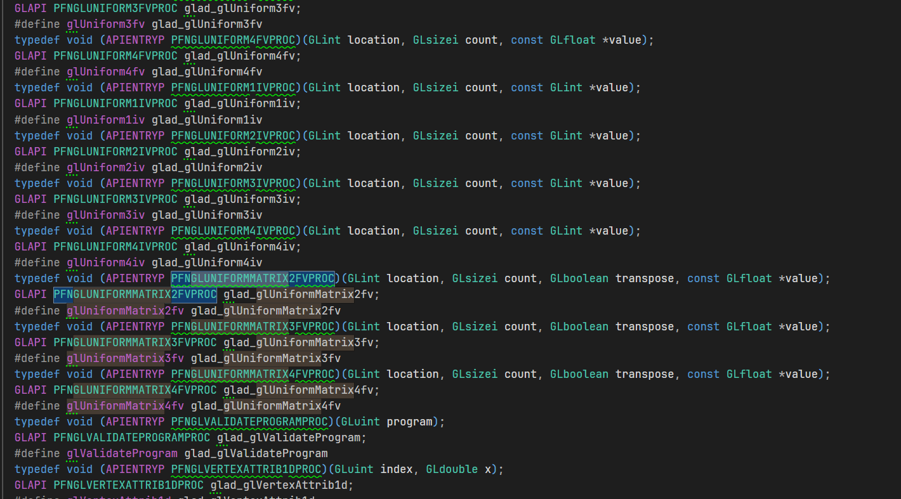
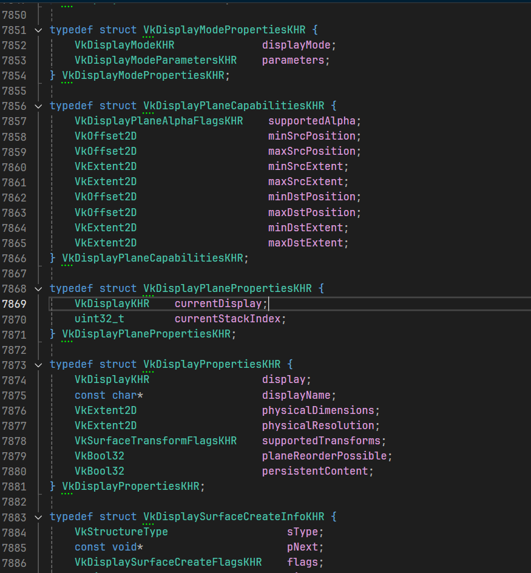
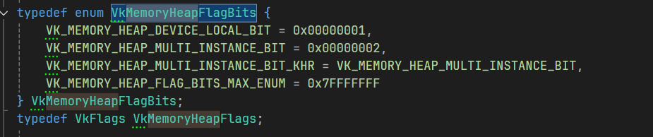
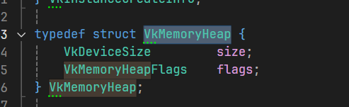
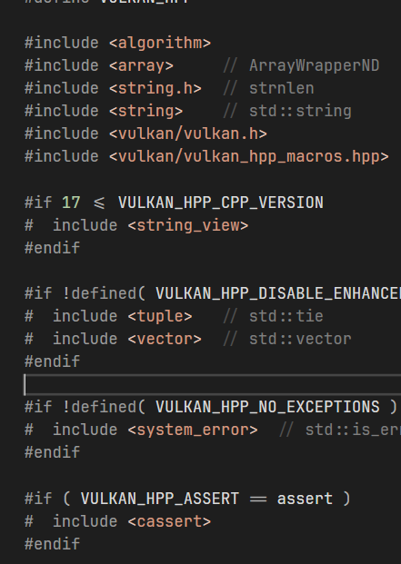
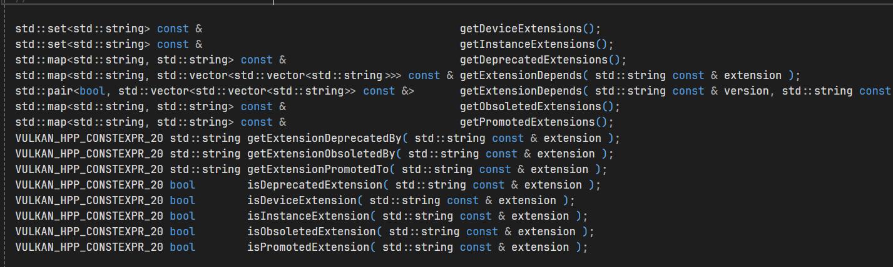

## 动机
khronos 这家公司唯一的贡献就是vulkan c api的设计, 出此之外做的都是屎  
以下来细细品尝它做的寄托答辩  

### opengl
首先是臭名昭著的opengl, 弱智状态机设计, 刚开始我还以为opengl在那个时代算是先进的设计, 后来才了解到早在那个时代这设计就是一坨屎了  
这tm状态机的设计是人能写出来的啊? 平时全局变量有状态函数给你用迷糊了是吧

此为khronos造的第一坨屎, 第一坨屎就如此重量级

### 命名
khronos的命名是它的第二坨屎, 同样是吃的最久的一坨屎  
先来指出它命名的缺点:
* 无意义的简写
* 大小驼峰混用
* 逆天前缀乱占用
* 自己不遵循自己的命名约定

看看opengl:


让我们来品尝品尝:
* PFNXXX: 神经病式的 PFN 前缀, 一个gl前缀不够这傻逼用的; 没事搞个无分隔全大写, 这名称给tm谁看的? 你特么自己第一眼看得出来你这命名的是个什么jb?
* GLint, GLsizei: 这名称我也是呵呵了, 似驼峰不是驼峰, 神他妈GL大写开头后面跟莫名其妙的小写, sizei是个什么鬼东东?
* glUniformMatrix3fv: 这会又他妈来gl前缀了, 写了半天终于知道驼峰怎么写了, 然后搞出来这么一坨fv, 喜欢我的fv吗. 太好了是khr啥比命名, 孩子们我们有救了

当然你可以说这是由于时代局限性整出来的这些, 让我们看看经过opengl这坨屎后khr做的反思, 于是造出来了vulkan命名这坨热乎的屎
  
  
  
乍一看似没什么毛病, 统一用驼峰, 名称也很规范  
实际上依然是依托答辩  
若把opengl的命名比做是刚学代码的人用a,B,CC,d2, d3给变量一通乱命名的话, 那么vulkan就是代码写了段时间, 被无数前辈骂过后, 知道变量命名不能用abcd了  
得写个有意义的名字, 于是就造出了什么VkAppleStruct, VkAppleEnum, 这一堆看似有意义, 实则什么都没表述出来, 依然是一坨的屎, 只是一眼看上去不会觉得是屎罢了  

来评鉴一下vulkan这坨屎:
* VkDisplayModePropertiesKHR, displayMode: 大小驼峰混用, 经典的用驼峰的就喜欢这么干, 名称中表示了其语法结构的信息本身也是一种耦合和偷懒  
* VkMemoryHeapFlagBits, VkMemoryHeap: 通辽语法  

听不懂? 我凭什么作为类名称的时候就用大驼峰, 作为变量的时候就用小驼峰?   
#### 偷懒:  
那我不是能写出来这样的代码: List list; 看似说了什么实则只说了个list, 一个list写两遍? 写你母呢    
如果我不按语法结构区分命名, 那么我只能写出这样的代码: List Students; 同样是两个词, 信息量翻了一倍   
为了省事将类型名换个命名方式, 而不考虑命名位students这样更有意的名称, 这就是在偷懒 
#### 耦合:  
考虑以下代码:
```cpp
namespace a{ struct Apple{}; }
namespace b{ using ::a::Apple; }
```
若按照vulkan的逻辑, 那么当这个Apple由类型变成函数或者变量时, 就得重命名为`apple`, 这时候b命名空间里的代码也得跟着变:
```cpp
namespace a{ static int const apple = 0; }
namespace b{ using ::a::apple; }
```
这就是一种耦合! 这跟匈牙利命名那种耦合变量名和类型信息的有什么区别, 只是匈牙利命名更臭名昭著一些

更何况他也搞出来个什么sType, pNext, pxxx等耦合类型信息的, 耦合也就算了, 特喵的你指针p开头你就都这么干啊. displayName不叫pDisplayName是几个意思?  
tm这时候知道这个啥比p有点多余了啊? 给其他变量起名字的时候怎么就光想着偷懒了?

### vulkan c++
打着c++幌子的脑残库, 我特么都懒得喷  
  
这些宿主头文件随随便便导入. 可见其水平低下  

::std::string, ::std::map, ::std::vector当玩一样返回, 你特么当成java在用啊? 不会写可以自己死远点别tm写, 标准库都用不明白的弱智玩意  

**用个api糊一手的屎, 你看得下去?**