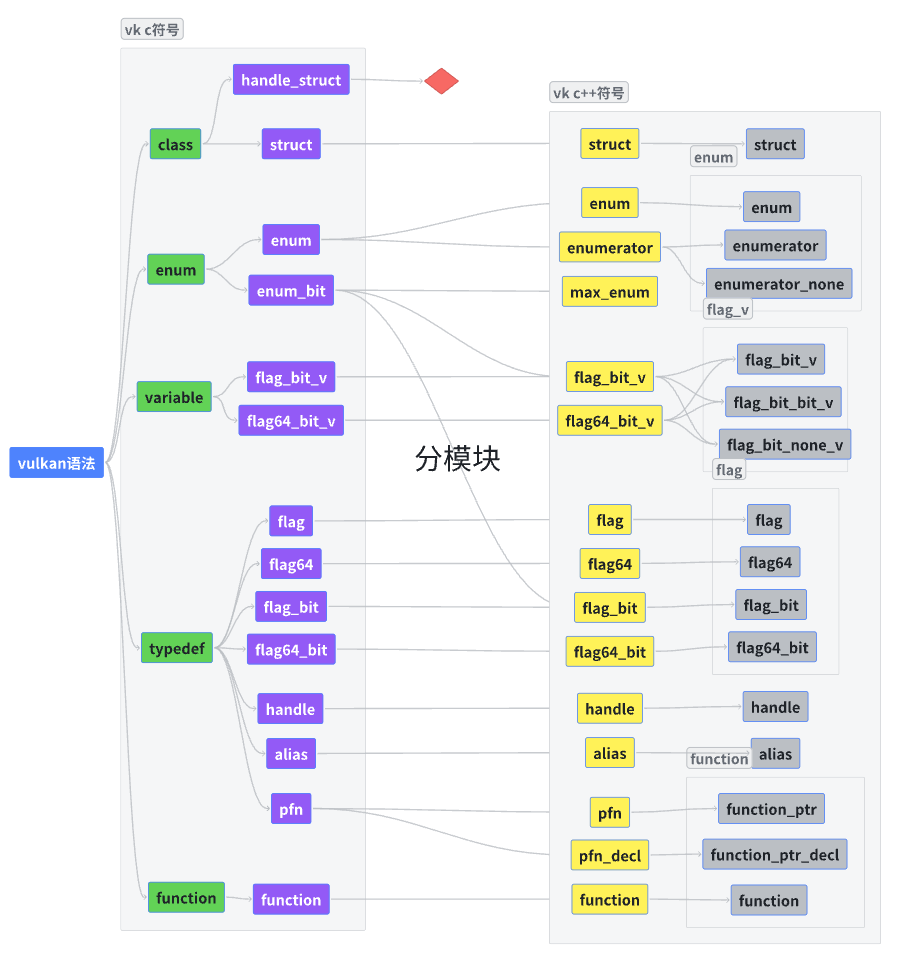

# vulkan c++ api pro

[中文](./docs/readme/zh.md)

## 介绍
本项目用于将vulkan的各个符号进行重命名, 在此基础上保证符号的语意, abi不变.  
旨在提供一个更好的vulkan编码环境

## 构建运行
纯python程序, 构建很简单
```shell
pip install -r requirements.txt
python ./main.py
```
> 开发用的python是3.11, 所以python版本最好在3.10以上

可以通过更改file来针对不同的文件, 可以换成你自己的文件

```python
# file = './test.h'
# file = './vulkan/vulkan_core.h'
file = '../../vulkan_core.h'
```
根目录下的vulkan_core.h是vulkan的删减版api, 用于测试用

## 思路
1. 通过clang的python库解析vulkan, 将其语法树转换成一种更友好的形式(past.language: 纯结构的包, 只表示数据)
2. 进入管线, 将vulkan语法树变为c++符号表
3. 按语法枚举vulkan中的语句, 参考[vk.lang.category.py 的 stmt类](./vk/lang/category.py) _(管线1: 语句分类)_
4. 按功能枚举出vulkan中的符号, 参考[vk.lang.category.py 的 c_symbol类](./vk/lang/category.py) _(管线2: 将语句变为分好类的c符号)_
5. 按转换表枚举出生成代码的符号, 参考[vk.lang.category.py 的 cpp_symbol类](./vk/lang/category.py) _(管线3: 将c符号变为c++符号)_
6. 按名称修饰类别分类c++符号, 参考[vk.lang.category.py 的 mangling](./vk/lang/category.py) _(管线4: 修饰c++符号名称, 生成c++符号表)_
7. 将c++符号表通过声明语法生成对应语法树
8. 解析语法树, 并生成代码

### 待完成
* 处理宏信息
* 将c++符号表导出, 保证不会出现不同版本之间符号名称不同的现象
* 拓展分模块
* 表达式生成器
* 初始化structure_type
* c++式的api

## vulkan 语句解析

